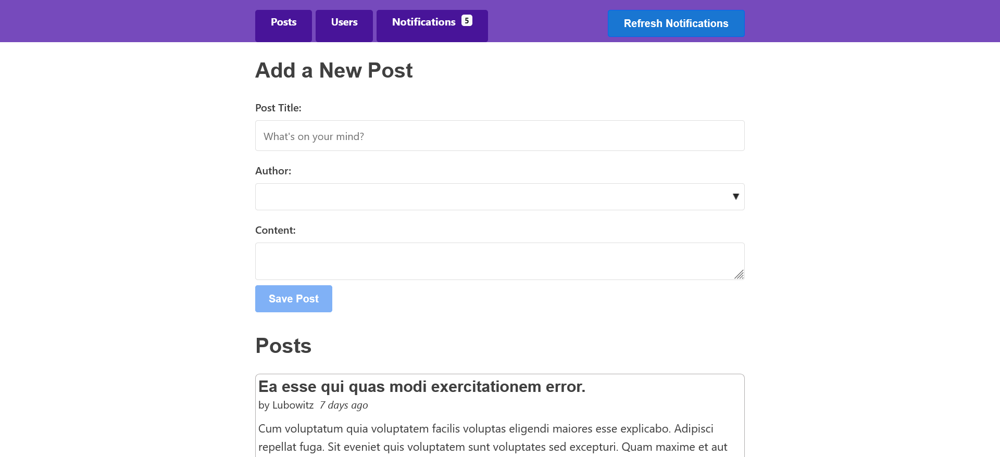
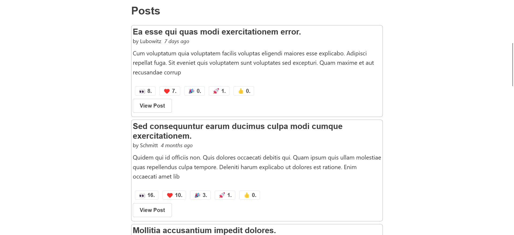

# React Project - Math Magician

This is a simple Blog app built with React.js, redux and json-server frameworks. this blog application is able to save new posts, display authors and their posts, and also enable users to like the posts.

## Table of contents

- [Overview](#overview)
  - [Screenshot](#screenshot)
- [My process](#my-process)
  - [Built with](#built-with)
- [Author](#author)

## Overview

This is a simple Blog app built with React.js, redux and json-server frameworks. this blog application is able to save new posts, display authors and their posts, and also enable users to like the posts.

### Screenshot

| Desktop version                              | Desktop version                              |
| -------------------------------------------- |-------------------------------------------- |
|  | |

### Run the project Locally

In order to install and run the project in your local machine follow the
following steps:

```
git clone https://github.com/MahdiSohaily/blog-app.git
cd blog-app
npm install
npm run dev
```

## My process

### Built with

- Semantic HTML5 markup
- CSS custom properties
- Flexbox
- CSS Grid
- Mobile-first workflow
- React.js framework
- redux
- json-server

## Author

- Frontend Mentor - [@MahdiSohaily](https://www.frontendmentor.io/profile/MahdiSohaily)
- Twitter - [@Mahdi_Rezaei_AF](https://twitter.com/Mahdi_Rezaei_AF)
- linkedIn - [@Mahdi-rezaei](https://www.linkedin.com/in/mahdi-rezaei-74705713b)
